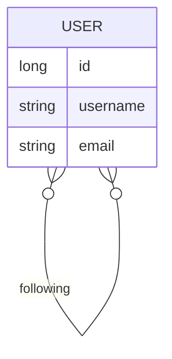

## 1.1 Crear proyecto

Comencemos por un proyecto vacío:

```
composer create-project symfony/skeleton:"6.4.*" symfony-redsocial
```

Y instalamos los componentes necesarios:

```
composer require symfony/maker-bundle --dev
composer require symfony/twig-bundle
composer require symfony/asset
composer require symfony/orm-pack
composer require symfony/profiler-pack
composer require form security validator
```


## 1.2 Gestión de Usuarios

Al igual que hicimos en el proyecto [Symfony Contactos](https://victorponz.github.io/symfony-contactos-teoria/posts/seguridad-y-control-de-accesos/), crearemos la gestión de usuarios ya que vamos a empezar por la parte más social del proyecto: la que permite a los usuarios seguirse.



En este diagrama se muestra la relación `N:M` para permitir que `1` usuario pueda seguir a `n` usuarios y que `1` usuario pueda ser seguido por `n` usuarios.

### 1.2.3 Creación de la relación

Mediante el comando `php bin/console make:entity User` nos aparecerá el asistente para modificar la entidad `User`.

El único campo nuevo va a ser `following` de tipo `relation` `ManyToMany` y que además cree la relación inversa llamada `followers` 

Así que la entidad `User` debe quedar así:

```php
// Otros campos
#[ORM\ManyToMany(targetEntity: self::class, inversedBy: 'followers')]
private Collection $following;

#[ORM\ManyToMany(targetEntity: self::class, mappedBy: 'following')]
private Collection $followers;

public function __construct()
{
    $this->following = new ArrayCollection();
    $this->followers = new ArrayCollection();
}

// Otros Setters y getters

/**
 * @return Collection<int, self>
 */
public function getFollowing(): Collection
{
    return $this->following;
}

public function addFollowing(self $userToFollow): static
{
    if (!$this->following->contains($userToFollow)) {
        $this->following->add($userToFollow);
    }

    return $this;
}

public function removeFollowing(self $userToUnfollow): static
{
    $this->following->removeElement($userToUnfollow);

    return $this;
}

/**
 * @return Collection<int, self>
 */
public function getFollowers(): Collection
{
    return $this->followers;
}

public function addFollower(self $user): static
{
    if (!$this->followers->contains($user)) {
        $this->followers->add($user);
    }

    return $this;
}

public function removeFollower(self $user): static
{
    if ($this->followers->removeElement($user)) {
        $user->removeFollowing($this);
    }

    return $this;
}

public function getFullName(): ?string
{
    return $this->fullName;
}

public function setFullName(string $fullName): static
{
    $this->fullName = $fullName;

    return $this;
}
```

## Rutas

Empecemos por la ruta para seguir a un usuario:

```php
    #[Route('/user/@{username}/follow', name: 'user_follow')]
    public function follow(Request $request, ManagerRegistry $doctrine, string $username, string $firewallName = 'main'): JsonResponse
    {
        // Sólo pueden seguir los usuarios logeados. 
        // Nos grabamos esta ruta para volver aquí después de logearnos
        $this->saveTargetPath($request->getSession(), $firewallName, $this->generateUrl("user_follow", ['username' => $username]));
        $this->denyAccessUnlessGranted("ROLE_USER");

        /** @var User $currentUser */
        $currentUser = $this->getUser();

        /** @var UserRepository $repo */
        $repo = $doctrine->getRepository(User::class);

        // Recargamos desde BD para asegurar que está "managed" y evitar errores de asociación en colecciones
        $user = $repo->find($currentUser->getId());

        $userToFollow = $repo->findOneBy(['username' => $username]);

        if (!$userToFollow) {
            throw $this->createNotFoundException("Usuario no encontrado");
        }
        // Si el usuario al que se quiere seguir no es el mismo que el logeado
        if ($userToFollow->getId() != $user->getId()) {
            $entityManager = $doctrine->getManager();
            $userToFollow->addFollowing($user);
            $entityManager->persist($userToFollow);
            $entityManager->flush();
        }

        return new JsonResponse([], Response::HTTP_OK);
    }
```

